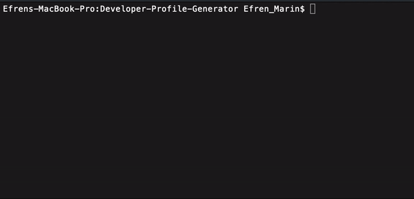

# Github Developer Profile Generator

## How to use
1) Download files
2) Install NPM packages
3) Run node index.js in CLI
4) Select index.html and run in browser

## Purpose
This project is meant to work with the Github API to be able to dynamically produce an HTML page with the users Github stats. Being able to simply generate a page using a Github username helps to create an easy snapshot of the users activity.

## Demo

## Project Status
The project is finished for the most part. While I would like to revisit this in the future to add more colors and borders, I am focusing on other repos at the moment. 

## Reflection
This project was a challenge and I loved every minute of it. Being able to put together my code and then spending hours trying to find out the best way to optimize it and make it work was satisfying. If I could change anything if I were to do it again, I would definitely work more with Github's API and structure my files and code better from the beginning. 

[Demo of Generated Page](https://efrenmarin45.github.io/Developer-Profile-Generator/)

No licenses. Creative purposes only. @Efrenmarin45 on GitHub.